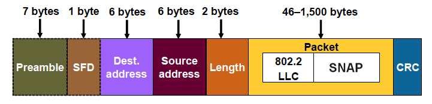

.. _week-05:

Week - 5 Linux-IoT Training
*************************

Task - 1: Physical Layer
=======================

Learn Physical layer (L-1) of OSI model In detail.

- What services are provided by physical layer.

- What protocols are used by physical layer. (Ethernet, Blue-tooth, USB, Controlled Area Network etc)

Task - 2: Ethernet
==================

- Most used topologies: Bus, Star

- Ethernet is passive (What means by passive).

- Ethernet used Broadcast topology with baseband signaling.

- Control methods used by Ethernet is CSMA/CD. Learn about CSMA/CD.

- What is back-off mode.

- What is broadband. What is Passive Hub. Jam Signal.

- Why CSMA/CD is not used in 802.11 standard? (Hint: half duplex mode, Hidden Nodes)

Task - 3: Ethernet Frame Format – 802.3 Standard
================================================

.. _eth_frame:

   Ethernet Frame 802.3 Standard

What is the function of each field in the frame .

=============================		===============================================================================================================================
Preamble 				Start of new frame & Synchronization conditions.
Start Frame Delimiter			Always 10101011 (171).
Length					Total number of bytes in data field		
Data					3-bytes = 802.2 = LLC =  DSAP (Destination Service Access Protocol):SSAP:Control (Type of LLC frame it is.)
CRC					Error Detection function
=============================		===============================================================================================================================

Task - 4: Link Layer
====================

Learn Link Layer (L-2) of OSI model in detail.

**Services**

==============================	    	===============================================================================================================================
Framing 	    			The structure of frame depends on the link layer protocols. (i-e Ethernet)
Link Access   	     			MAC protocol specifies the rules by which frame is transmitted onto the link. Sender sends frame whenever the link is idle.
Reliability
Error Detection and Correction		CRC & Checksum
==============================	    	===============================================================================================================================

**Where is the link layer implemented?**

Link layer is implemented in link layer controller of NIC (Network Interface Card), a special purpose chip - hardware that performs the desired services as we discussed above.

**Parity Checks**

What are 2-dimensional parity checks. Why it is useful over the 1-D parity checks.

**Checksum & CRC**

We have done it in already previous weeks.

**Types of Network Link Protocols**

**PPP – Point-to-Point Protocol**

Protocol for communication between only 2 hosts over a common link.

**Broadcast Link Protocol**

Protocol for communication between different hosts over a shared link. Multiple Access problem mightbe caused.

**Channel Partitioning protocols**

- FDMA

- TDMA

- CDMA

**Random Access Protocols**

- Aloha

- Slotted Aloha

**Reference:** Computer Networking A Top Down Approach

