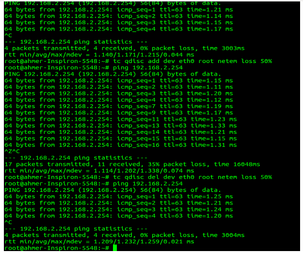

.. _week-07:

Week - 7 Linux IoT Training
***************************

Task - 1: TCP Congestion Control
================================

Learn TCP Congestion control in detail. What is Bandwidth, Round Trip Time, Packets Loss? What is tuning of TCP? What is window? What is slow start, congestion avoidance and different congestion control algorithms and their difference.

Compare different congestion control algorithms by developing a network
-----------------------------------------------------------------------

**Develop a network that PC-2 acts as router, PC-1 and PC-2 acts as source or destinations, all are connected through Ethernet cables. By using different congestion control algorithms, copy a file of 1GB on either computer and store the data-rate in a text file. Based on the data rate stored, plot the graphs using GNU-plot in Linux. Explain your understandings.**

.. _congestion_net:
.. figure::  images/CONGESTION_NETWORK_07.png
   :align:   center

   Congestion Control Network Architecture

**PC - 1**
 
1.	Add eth0 → EDGE_1 → EDGE_1 IP = 192.168.2.249, netmask = 255.255.255.252

2.	Add route for eth0 (PC-2)

3.	sudo route add -net 192.168.2.252 netmask 255.255.255.252 gw 192.168.2.250 

**PC - 2**

1. 	It should have two Ethernet ports. Attach an Ethernet adapter.

2. 	Add eth2 → EDGE_2 → EDGE_2 IP = 192.168.2.250, netmask = 255.255.255.252 (PC - 1 & PC – 2 adapter using LAN cable ).

3.	 Add eth0 → EDGE_3 → EDGE_3 IP = 192.168.2.253, netmask = 255.255.255.252 (PC - 2 & PC – 3 using LAN cable ).

**PC - 3**

1.	Add eth0 → EDGE_4 → EDGE_4 IP = 192.168.2.254, netmask = 255.255.255.252

2.	Add route for eth0 (PC-2)

3.	sudo route add -net 192.168.2.248 netmask 255.255.255.252 gw 192.168.2.253

Now, check using Ping that PC-1 should be able to communicate uptil eth-0 (SW-4) of PC-3 and vice-versa.

Task – 2: Compare different congestion control algorithms by developing a network
=================================================================================

Develop a network that PC-2 acts as router, PC-1 and PC-2 acts as source or destinations, all are connected through Ethernet cables. By using different congestion control algorithms, copy a file of 1GB on either computer and store the data-rate in a text file. Based on the data rate stored, plot the graphs using GNU-plot in Linux. Explain your understandings.

Task – 3: NETEM Driver – Network Emulation
==========================================
 
Learn how to add latency, noise and packet loss into a network. Useful link: http://www.linuxfoundation.org/collaborate/workgroups/networking/netem

**iproute2**

Linux package contains a collection of utilities for controlling TCP/IP networking and traffic control in Linux.

The current version of netem driver emulates variables  delay, loss, duplication and re-ordering.

How to add fixed delay to all packets.

Latency
-------

``tc qdisc add dev eth0 root netem delay 100ms``

.. _latency:
.. figure::  images/LATENCY_07.png
   :align:   center

   Latency Results

Packet Loss
-----------

``tc qdisc add dev eth0 root netem loss 0.1%``

.. _packet_loss:

   Pscket Loss Results

Packet Corruption – Noise
-------------------------

tc qdisc add dev eth0 root netem corrupt 0.1% (it introduces single bit in error).

Linux TCP Tunning helpful link: http://kaivanov.blogspot.com/2010/09/linux-tcp-tuning.html

Create 300 MB Raw Data File
---------------------------

dd if=/dev/sda1 of=/home/ahmer/TCP_data.img bs=1G count=10

``script -q -c "scp -rp /home/ahmer/TCP_data_300MB.img ahmer@192.168.2.254:/home/ahmer/" > /home/ahmer/TCP_reno``

cut desired data into TCP_reno_2

Filter: ``cat TCP_reno_2 | cut -d'%' -f2 | cut -d" " -f5  > TCP_reno_3``

How to check the available Congestion Control algorithms modules.ko in your kernel.

``ls /lib/modules/`uname -r`/kernel/net/ipv4/``

How to find running CC modules on your kernel?

``root@ahmer-Inspiron-5548:/proc/sys/net/ipv4#  sysctl net.ipv4.tcp_available_congestion_control`` 

``net.ipv4.tcp_available_congestion_control = cubic reno``

What if your desired CC modules are not running?

``/sbin/modprobe tcp_bic`` 
``/sbin/modprobe tcp_highspeed``

How to change /set the TCP CC algorithm?

``root@ahmer-Inspiron-5548:/proc/sys/net/ipv4# echo reno > tcp_allowed_congestion_control``

Task - 4: Make Your Own Web-Server
==================================

**How to Download a file from a web-server?**

**Apache:** 	Hypertext Transfer Protocol Service

**Curl:**		Transfer a URL

Steps
-----

#. 	Install apache2 on server.
#.	Copy the desired files in directory /var/www/html.
#.	curl -o filename http://<IP-Address>/filename_wanted_to_download
#.	You can Download the file using web-browser as well.

**How to change the directory of web-server?**

sudo vim /etc/apache2/sites-available/000-default.conf

Change: DocumentRoot /var/www/html → DocumentRoot /your/directory/

sudo vim /etc/apache2/apache2.conf

change:	<Directory /var/www/html/>  –> <Directory /your/directory/>

Options Indexes FollowSymLinks

AllowOverride None

Require all granted

</Directory>

Task - 5: GNU-Plot
==================

Learn how to use GNU-Plot in Linux for elaborated graphing such as tiltle, X, and Y axis legends, sub-plotting, reading data from a file etc.

**How to install?**

Sudo apt-get install gnuplot-qt rlwrap

Settings
---------
For doing diffrent settings for gnu-plot and help :ref:`gnu_plot`

Task - 6: Git-Hub
=================

Why Git-Hub is used? Make an account on Git-Hub and how to setup git on you Linux machine. Upload some of your codes on the git-hub using command line.

1.	Make an account on www.github.com.

2.	Install git on your linux machine sudo apt-get install git.

3.	ssh-keygen -t rsa -b 4096 -C “ahmer.malik@linuxiot.org”.

4.	ls -l .ssh		→	Check the list

5.	mv linuxiot* .ssh	→	move linuxiot (with whatever extension) to .ssh folder.

6.	chmod 0600 .ssh/linuxiot* → Change the ownership of the files only to the user (read & write).

7.	cat linuxiot.pub → Copy all the contents of file to website of github.
	
	``https://github.com/settings/ssh →  Add SSH Key`` copy all the contents here.

8.	Make your git repository folder_name = git-repo. Cd into your repository.

9.	git init.

10.	git config  - -global user.email “ahmer.malik@linuxiot.org”.

11.	git config  - -global user.name “Ahmer Malik”.

12.	Go into your browser → github → select ssh and copy its content (A path git@/..../)

13.	git remote add origin (paste the copied path) git@github.com:LinuxIoT/training.git.

14.	ssh-add /home/ahmer/.ssh/linuxiot

15.	vim test	→ Make afile with whatever data.

16.	git add test

17.	git commit -m “test”

18. 	git push –set-upstream origin master		or	git push origin master	 

19.	git pull →  git push

20.	git config –global push.default simple

**How to make a new branch?**

Only 1 master branch, we are working with till now.

To create new branch:	git checkout -b develop

To delete a branch:		git branch -d name_branch

To switch to that branch:	git checkout develop

Back:				git checkout master

To view branches:		git branch -a
	
Task - 7: Basic Interaction with Python
=======================================

Learn basic interaction with python environment using Idle-2.7. What are Lists and how variables, functions and modules are defined in python. Try to explore, what is the benefit of choosing python over other languages.
