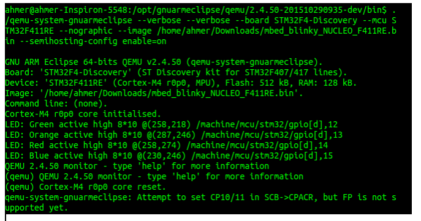
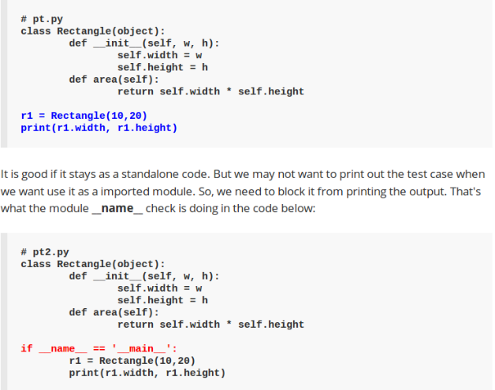

.. _week-08:

Week - 8 Linux IoT Training
***************************

For learning Python or OOP follow the `link <http://www.tutorialspoint.com/python/python_classes_objects.htm>`_

Task – 1: Practice of writing code in Python 
============================================

Write a python code that should do following steps.
#. Get the file-system list and store it in a file fs.txt
#. Get size in KB for each element ( i-e /opt, /etc) in the file-system.
#. Store the size in dictionary across the name of directory. { i-e /opt: 4KB }
#. Print that dictionary in a dictionary.txt file in readable form.

How to Proceed
--------------
#. Import os (Read about OS class, what type of methods it provides and those that might help).
#. Learn how to read and write a file in python.

		fd = open('/opt/pylabs/fs_list', 'w')

		for each_item in fs: 

			fd.write(each_item)

#. Read about the data-types lists and dictionary. What are these and how they are used in python.
	
		Dictionary {'Ali' : 0 , 'Akram' : 1}

		List ['Ali' , 1 , 'Ahmer' , 2 ]

#. What is the benefit of using os.stat method of OS class.

		See the stats of the file or directory.

#. How to access a particular value like size from lists of different stat information.
	
		a = os.stat(line)

		print (a[6])

#. How to remove the last character from a string line.
	
		line[:-1]

#. How to concatenate different strings and how to covert an integer into string.

		line + ":" + str(A)  + "\n"
   

Task – 2: Object Oriented Programming in Python
===============================================

Write the above program again, but now using OOP concepts.

How to Proceed
--------------

#. How to declare a class in python.
		
		class Class_Name : (“: at the end”)

#. What is class variable.
	
	A variable that is shared by all instances of a class. Class variables are defined within a class but 	outside any of the class's methods. Class variables are not used as frequently as instance 	variables are.
 
#. Constructor Declaration

		def __init__(self, name, salary): 

      			self.name = name 

      			self.salary = salary 

      			Employee.empCount += 1

#. Define methods or functions

		def Function_Name(self):	(“self” is compulsory)

			Implementation

Code
----

The see code `click here <https://github.com/LinuxIoT/training/blob/DEV/get_fs_dict_class.py>`_.

Task – 3: Importing a class in another File
===========================================

Repeat the same task, but now the class should be declared in one python file named as class.py. While the object of that class should be instantiated in another python file, named as class_main.py.

How to Proceed:

#. Class definition in a separate file : class.py

	class name_class:

		def __init__(self, other arguments)
			.

			.

			.

#.  How to import a class : class_main.py

	Three different ways:
	 – import  file_name_that_have_class_definition ---> ``import class  (no need of extension .py)``

 	 – from  file_name_that_have_class_definition import * (All classes in that file) ``from class_name import *``

	 – from  file_name_that_have_class_definition import class_name ``from class_name import class_name``
  
#. Class object instantiated in another file.

	– X = file_name.class_name(“Constructor arguments initiallization”)

		X.Methods()

	– X = classname (“Constructor arguments initiallization”)

		X.Methods()

Code
----

The see code `click here <https://github.com/LinuxIoT/training/tree/DEV/GET_FS_Dictionary_Task_classified>`_.

Task - 4: Reading Configuration Files (name.conf)
=================================================

What are configuration files and how to write it in python? How to read it and extract the information to be processed by accessing different OPTIONS and its variables.

Write a .py code that reads STATS.conf file that contains two options [SYSTEM, DIRS]. I have to extract out the STATS variable of SYSTEM and write the information in a text file based on the parameters stored in variable (i.e memory, cpu and processes etc.). 

In another text file store the disk information of all the directories mention under the [DIRS] option.

Code
----

The see code `click here <https://github.com/LinuxIoT/training/tree/DEV/Reading%20Conf%20Files%20%28TASK%20-%202%29>`_.

INHERITANCE
-----------

Children inherit some of their characteristics from their parents. Same concept is used in OOP, in order to avoid the re-creation of same piece of code in another class for writing more functional classes. The more functional class inherits the functionality of previously written class and can use it for some other software creation.

Super / Parent Class 
++++++++++++++++++++

The class that provides its functionality to another class.

Sub / Child Class
+++++++++++++++++

The class that inherits the functionality parent.

In Python, all classes are sub classes technically.

– When we declare a class as class name_of_class : → class name_of_class ( object ).

– Those class class do not inherited from some other class are inherited from special class “object”.

Example::
#!/usr/bin/python 
class contact:: 
	all_contacts = [] 
	 
	def __init__ (self, name, email): 
		self.name = name 
		self.email = email 
		contact.all_contacts.append(self) 
		 

class supplier(contact):: 
	 
	def order(self): 
		print ('Hello I have shared the contacts of suppliers\n')

if __name__ == '__main__'::

	s1 = supplier("Ahmer","ahmer.malik@linuxiot.org") 
	print ( s1.name + ':' + s1.email + '\n') 
	s2 = supplier("Weqaar","weqaar.janjua@linuxiot.org") 
	print ( s2.name + ':' + s2.email + '\n') 
	print s1.all_contacts 

Task – 5: Multi-Processing
==========================

What is multi-processing? What is the difference between a process and a thread? Learn the multiprocessing [Process] module in Python.

Write a code that can familiarize you how to do multi-processing and differentiate between the results of multiple process program and sequential program as we do traditionally.

CODE::

	from multiprocessing import Process 
	import time 

def f1():: 
    
	print' P-1 Started' 
	for i in xrange (0,10000): 
	print 'NUM = %d\n' % i 
	print  ' P-1 ENDED' 

def f2()::
 
	print 'P2 - Started' 
	for i in xrange (10000,20000): 
	print 'NUM = %d\n' % i 
	print 'P2 - ENDED' 

def without_multi_process()::
 
	f1() 
	f2() 

def multi_process():: 
    
    p1 = Process(name ='Function - 1' , target=f1) 
    p2 = Process(name ='Function - 2' , target=f2) 
    p1.start() 
    p2.start() 
    p1.join() 
    p2.join() 
    
if __name__ == '__main__':: 

	_start = time.time() 
	multi_process() 
	_finish = time.time() 
	t1 = _finish - _start 
	_start = time.time() 
	without_multi_process() 
	_finish = time.time() 
	t2 = _finish - _start 
	print 'Time with multi_processes = %.8f seconds\n' % t1 
	print 'Time without multi_processes = %.8f seconds\n' % t2 
    

Task - 6: Queues
================

What are queues and how to make a queue in python. Learn how to use [ Queue class of multiprocessing ].
 
Write a code that make a server.py that makes a queue of some friends. A client name “writer.py” can write on that queue and another client “reader.py” can read that queue.

Code
----

The see code `click here <https://github.com/LinuxIoT/training/tree/DEV/Reading%20Conf%20Files%20%28TASK%20-%202%29>`_.

**Learn about some other modules in Python.**

#. Sockets
#. Serial - - sudo setserial -g /dev/ttyS[0123]
#. Daemon

Task - 7: Setup QEMU for ARM Cortex M4 32bit CPU
================================================

What is QEMU? 
-------------

It is used for emulation or virtualization. Emulation means we can write c codes for some other processor family. Instead of purchasing that processor to check, we can simply check our code performance and debugging using emulator. We can say that it virtualize a board.
    
Link: http://gnuarmeclipse.github.

**What is mBedOS?**

MbedOS is online IDE that can compile (cross-compilation) codes for different development boards using its C++ API.
Compile a binary using their online IDE, for the board/chip supported by Qemu and run on it to verify.

*** Link - Learn mBed 

https://drive.google.com/folderview id=0B9Whv5cCE_iEfldHdkp0RWtJbVhYeUFxWFcxNVQxaEpkeVZudS1YTUJtOGFOZVUzdlRhTHM&usp=drive_web

I compile a binary for NUCLEO_F411RE board and run using QEMU as follows. 

.. _qemu_mbed:

   Output of File Compile by mbed on Qemu

**What is the meaning of __main__ in Python?**

.. _py__main__:

   Proof that getting rich is mostly luck.

Useful Information
==================

Differentiate between Mutable and Immutable Data types? 

https://lukewickstead.wordpress.com/2015/06/12/mutable-vs-immutable/

Install psutil module: ``sudo pip install psutil``

**Error:**

compilation terminated. 

error: command 'x86_64-linux-gnu-gcc' failed with exit status 1

**Solution:**

``sudo apt-get install python-dev``

``sudo pip install psutil``

>>> psutil.phymem_usage()
>>> usage(total=4153868288, used=2854199296, free=1299668992, percent=34.6)
``cat meminfo | grep "MemTotal:" | cut -d' ' -f9``

