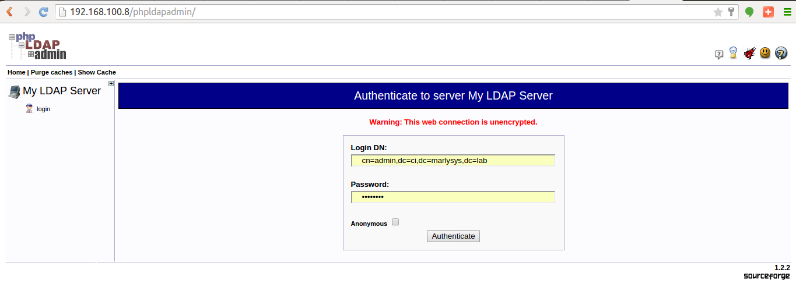

.. _chapter5:

======================
Chapter 5: LDAP Server
======================

The purpose of this Virtual Machine is to provide backend Light-weight Directory Access Protocol services to other VMs.

Overview
--------

LDAP software used is ``OpenLDAP``.

Configuration Details
---------------------

The VM is configured according to parameters defined in the tables as under.

+--------------------------------------------------------+
| | Network Connectivity for Virtual Machine             |
+=============+==========================================+
| IP ADDRESS  | | 192.168.100.8                          |
|             | |                                        |
|             | | Alternate address may be assigned at   |
|             | | build time as a parameter to script    |
|             |   ``build.sh``                           |
+-------------+------------------------------------------+
| MAC ADDRESS | | Randomly generated at the time of      |
|             | | provisioning                           |
+-------------+------------------------------------------+

+-------------------------------------------------------------------------------+
| | Network Services                                                            |
+=============+=============+==========+========================================+
| **Service** | **Protocol**|**Port**  | **Configuration Files**                |
+-------------+-------------+----------+----------------------------------------+
|SSH	      |TCP	    |22	       | | /etc/ssh/sshd_config                 |
+-------------+-------------+----------+----------------------------------------+
|LDAP	      |TCP	    |389       | | ~/slapd.sh: for initial configuration|
|             |             |          | | ~/structure.ldif: contains the info  |
|             |             |          |                     about the groups   |
|             |             |          | | ~/user.ldif: contains user info      |
|             |             |          | | NOTE: default username is ‘hdumcke’  | 
|             |             |          |         and passwd ‘pAssw0rd’          |
+-------------+-------------+----------+----------------------------------------+

Functions of Virtual Machine
----------------------------

* Provides LDAP Directory services
* Provides a web console for configuration of LDAP server

Access the VM Web Console to configure LDAP, username is set to ``hdumcke`` and password is set to the default ``pAssw0rd`` on first boot.

Logon to the URL using a web browser: `http://192.168.100.8/phpldapadmin <http://192.168.100.8/phpldapadmin>`_

Fill in the password with the default.

You should be able to login.

